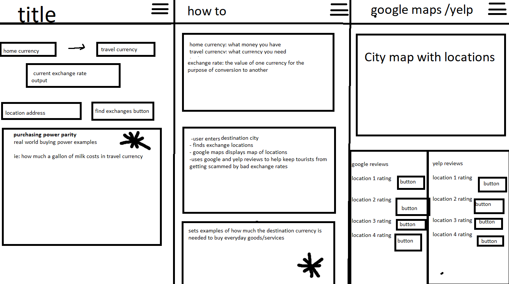

# [Papyromancy](https://dylandewey.github.io/Papyromancy/)
**Papyromancy:** A way of divination through folding paper. Some say a true papyromancer can crumple up any piece of paper, unfold it, and predict the future from the creased lines
reading the creased paper the way that a palm reader would read a person's palm.
-Wikipedia

When it comes to currency exchange, sometimes it seems the exchange rates are as ambiguous as a fortune teller.  The rates can be all over the 
board, and how do we know if we are getting a fair rate?  We've created an app that will give you the current exchange rate when exchanging American dollars to another currency.
We've also included a purchasing power parity that will give you a better idea of how far your dollar will go in those countries.  

## Pseudocode
Once we decided to make this app we started writing pseudocode to map out our plan of action.  Then we made a wireframe diagram to get an idea of how we wanted the 
app to present itself on a device.  Because the world is going mobile we wanted it to be an app that was mobile first.  We divided up tasks to start the project and 
got to work.  

## The Process
We wanted to divide up the tasks according to our coding strengths, but also wanted to get exposure in areas we need more practice.  Within our group we put one who was stronger in an area with one who needed practice in that area and vice versa.  Once we got the main framework we all worked together to get it functioning.  It worked great to 'mob code' having everyone figuring out how to make it work and researching different ideas and topics.  Our biggest challenge was merging errors in github.  We made it work but didn't get it to work smoothly until closer to the end of the project.  

## Resources
We used 2 server side API's in our app.  A **[currency converter API](https://free.currencyconverterapi.com/)**, and a **[purchasing power parity 
API](https://purchasing-power-parity.com/)**.  For the base framework and design of our app we used **[Materialize](https://materializecss.com/)**. To call the API's in our code we used **[Axios](https://www.npmjs.com/package/axios)**.

## Future Development
We plan to continue working on this project and add currency exchange locations, directions, and ratings to each establishment.  We will also add more currency and country options to convert from USD.  We'll add the option to convert from other currencies other than USD.  

